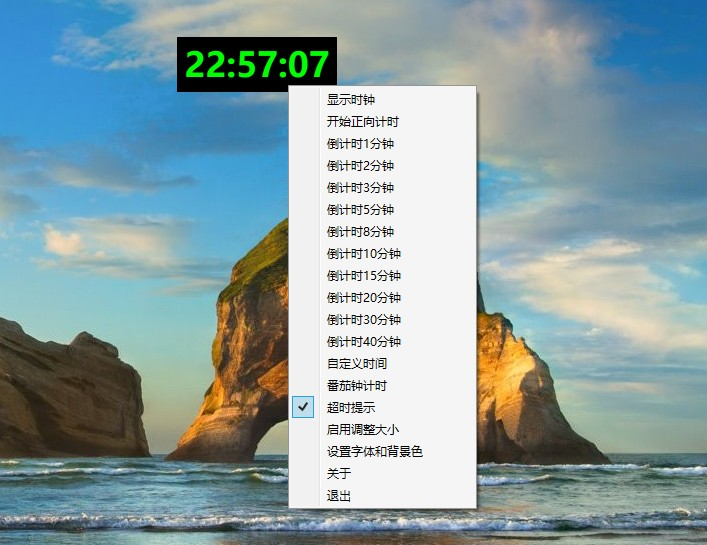

注意：请保持dll、exe主程序、alarm.wav在同一个文件夹下

更新日志：

2023-04-15：
1. 默认配色改为黑底绿色
2. 增加空格键暂停倒计时功能
3. 支持脱离dll文件单独运行，这意味着调色板功能失效
4. 支持记录计时器关闭的位置，下次启动有效
5. 支持自定义时间，精确到分钟+秒数
6. 支持自定义提示音(替换掉当前目录下的alarm.wav即可)

2023-04-08：
功能说明：
主要功能有：
1. 倒计时
2. 时间显示：时分秒
3. 支持自定义背景色和字体色
4. 配色方案和提示开关，在下次启动时生效

发布链接：
https://www.52pojie.cn/thread-1769959-1-1.html

 

  
